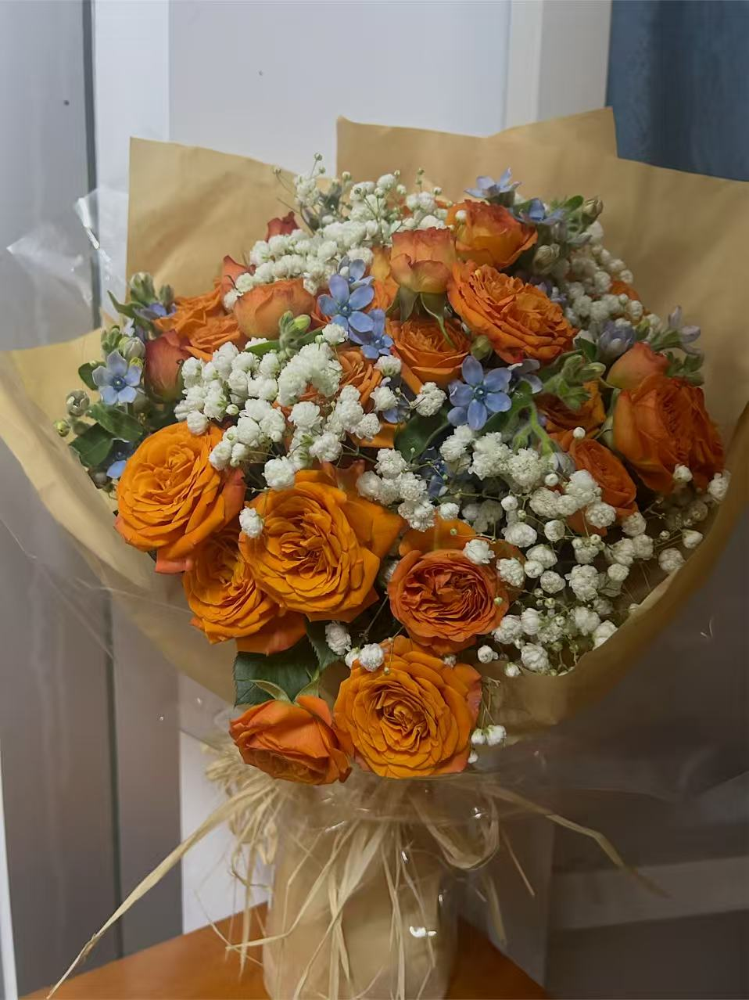

  

你好呀！
这里是我的个人日记站，欢迎你~

这里不只有我的日记，  
还有我的杂学考究（其实是好奇心作祟），
可能也有对喜欢的作品的随想，
说不定还会出现对于爱与正义的思考，
偶尔偶尔也有可能会有一些情绪片段。

我不知道这些文字最终会被谁读到， 
但如果你碰巧来到这里，
我希望它们能让你对我产生更多的了解，
也希望能让你能怀着愉悦的心情离开这里，
或者是在看完后产生一些新的思考。
我做这个网站的目的就是学会大大方方表达，
所以如果你读完我的文章后有什么感想，
欢迎点开下面的留言箱告诉我。

<a href="留言箱" class="mailbox-entry" aria-label="留言箱">
  
    <svg xmlns="http://www.w3.org/2000/svg" width="28" height="28" viewBox="0 0 24 24" fill="none" stroke="currentColor" stroke-width="2" stroke-linecap="round" stroke-linejoin="round">
      <path d="M22 17a2 2 0 0 1-2 2H4a2 2 0 0 1-2-2V9.5C2 7 4 5 6.5 5H18c2.2 0 4 1.8 4 4Z"/>
      <polyline points="15 9 18 9 18 11"/>
      <path d="M6.8 5C8.6 5 10 6.6 10 8.5V17a2 2 0 0 1-2 2"/>
      <line x1="5" x2="7" y1="10" y2="10"/>
    </svg>
  
  留言箱
</a>

